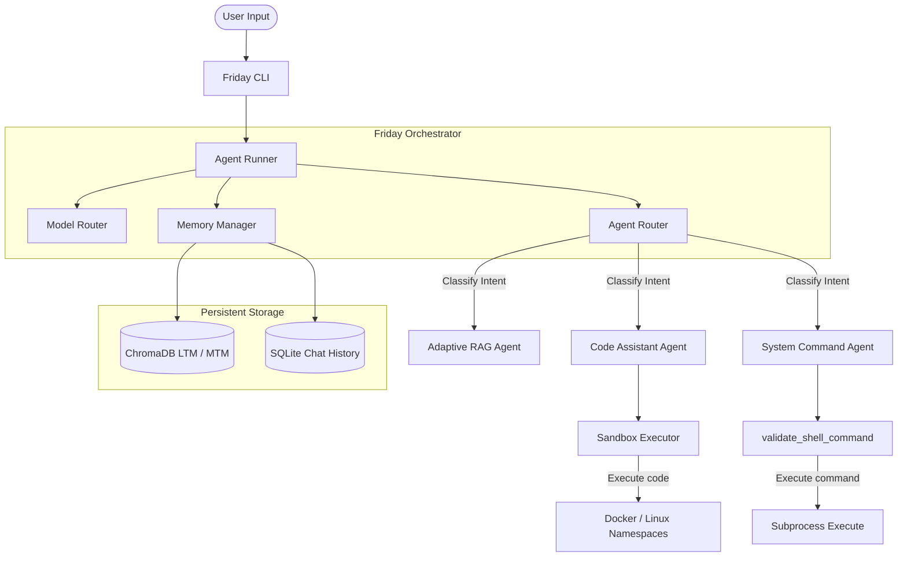

# 🎙️ FRIDAY: Local-First Personal AI Assistant

[](https://opensource.org/licenses/MIT)
[](https://www.python.org/downloads/)
[](https://github.com/astral-sh/ruff)
[]()

FRIDAY (Female Replacement Intelligent Digital Assistant Youth) is a local-first, privacy-centric AI assistant framework designed to run entirely on consumer hardware. Combining offline speech-to-text, text-to-speech synthesis, persistent memory databases, and isolated code/command execution sandboxes, FRIDAY delivers an offline digital assistant experience without cloud data leaks.

---

## 📖 Table of Contents
- [Project Directory Structure](#-project-directory-structure)
- [Architecture & Flow](#-architecture--flow)
- [Key Features](#-key-features)
- [Prerequisites](#-prerequisites)
- [Installation](#-installation)
  - [For Users](#for-users)
  - [For Developers](#for-developers)
- [Usage](#-usage)
  - [CLI Subcommands](#cli-subcommands)
  - [Interactive Shell Control Commands](#interactive-shell-control-commands)
- [Configuration Reference](#-configuration-reference)
  - [MCP Server Setup Example](#mcp-server-setup-example)
- [Security Sandboxing & Guardrails](#-security-sandboxing--guardrails)
- [Development & Testing](#-development--testing)
- [Troubleshooting](#-troubleshooting)
- [License](#-license)

---

## 📂 Project Directory Structure

```
friday/
├── pyproject.toml         # Package metadata, scripts, and dependency definitions
├── README.md              # Project documentation
├── src/
│   ├── friday/            # Core package
│   │   ├── agents/        # Intent agents (Code Assistant, Adaptive RAG, System Commands)
│   │   ├── core/          # Orchestration engine, MCP client, permissions, session context
│   │   ├── llm/           # Local (Ollama) and cloud/API LLM engines
│   │   ├── memory/        # SQLite history database & ChromaDB vector store
│   │   ├── plugins/       # Dynamic extension points and plugin manager
│   │   ├── skills/        # Handlers for tools (browser control, web search)
│   │   │   └── browser_daemon/ # Standalone compiled browser daemon process
│   │   ├── tui/           # Terminal UI (onboarding apps, hardware scanning)
│   │   ├── utils/         # Telemetry, logging, and security verification
│   │   ├── voice/         # Offline STT (Vosk) & TTS (Piper) drivers
│   │   └── cli.py         # Main CLI commands entry point
│   └── friday_model_scout/# Model Scout package (LLM compatibility scanner)
└── tests/                 # Unit and integration test suites
```

---

## 🏗️ Architecture & Flow

FRIDAY manages user inputs using a decoupled agent-router orchestration architecture:



1. **Memory Manager (MTM & LTM)**: Interacts with an asynchronous SQLite backend (for short-to-mid-term state) and a ChromaDB vector store (for long-term semantic RAG). DB migrations/table setups are securely awaited to prevent race conditions during early execution.
2. **Agent Router**: Evaluates intent in parallel with memory lookups to select the correct specialized agent.
3. **Execution Guardrails**: Restricts commands and code to sandboxed spaces, vetting inputs through tokenized AST parsers and blocklist validators.

---

## ✨ Key Features

* **🌍 Multi-Provider LLM Engine**: Native support for local backends (Ollama) and cloud APIs (OpenAI, Gemini, Mistral, Groq, OpenRouter).
* **🗣️ Offline Voice Integration**: Real-time Speech-to-Text (STT via Vosk) and high-quality Text-to-Speech (TTS via Piper).
* **🧠 Tiered Vector Memory**: Integrates short-term session state, mid-term SQLite chat logs, and long-term vectorized RAG knowledge bases.
* **🛡️ Secure Sandboxed Code Execution**: Run untrusted python code inside resource-restricted Docker containers or Linux Namespaces (`unshare`).
* **🔍 Model Scout**: Scans CPU cores, RAM, and GPU VRAM to dynamically score and recommend the optimal LLM size/quantization for your machine.
* **🔌 Native MCP Client**: Implements the Model Context Protocol to integrate external tools and servers safely.

---

## 🛠️ Prerequisites

* **Python 3.10+** (Required)
* **Ollama** (Recommended for local LLM engines)
* **PortAudio** (Required for speech recognition/input)
  * *Ubuntu/Debian:* `sudo apt install portaudio19-dev`
  * *Fedora/RHEL:* `sudo dnf install portaudio-devel`
  * *macOS:* `brew install portaudio`
* **Docker** (Recommended for maximum code assistant isolation)

---

## 🚀 Installation

### For Users
Install the package directly into a virtual environment:
```bash
# Clone the repository
git clone https://github.com/your-repo/friday.git
cd friday

# Setup virtual environment
python3 -m venv .venv
source .venv/bin/activate

# Install package
pip install .
```

### For Developers
Install optional development and testing extras in editable mode:
```bash
pip install -e ".[dev]"
```

---

## 💬 Usage

### CLI Subcommands

| Command | Description |
| :--- | :--- |
| `friday init` | Launches the onboarding wizard TUI to configure backends and model preferences. |
| `friday` | Enters the interactive chat shell loop. |
| `friday ask "<query>"` | Runs a single prompt execution. Append `-v` or `--voice-output` for TTS vocal responses. |
| `friday doctor` | Diagnoses local voice models, system hardware, audio input, and LLM API availability. |
| `friday model-scout` | Auto-scans hardware and scores/recommends compatible LLM sizes. |
| `friday config list` | Lists all configuration keys and active values. |
| `friday config set <key> <val>`| Sets a configuration key. |
| `friday memory list` | Lists stored conversation sessions. |
| `friday memory search "<q>"` | Performs semantic search query over MTM and LTM stores. |
| `friday traces list` | Lists telemetry event traces of recent agent activity. |

### Interactive Shell Control Commands
Within the active `friday` chat loop, control the terminal state using:
* `/voice on` : Enables microphone STT listening mode and vocal TTS responses.
* `/voice off` : Disables voice mode and returns to text-only mode.
* `/exit` / `/quit` : Shuts down active connections and exits the loop.

---

## ⚙️ Configuration Reference

Friday stores its settings in `~/.friday/config.yaml`. The schema structure is as follows:

| Config Key | Default Value | Type | Description |
| :--- | :--- | :--- | :--- |
| `logging.level` | `"INFO"` | `str` | Minimum log output level (`DEBUG`, `INFO`, `WARNING`, `ERROR`). |
| `logging.file` | `"~/.friday/logs/friday.log"` | `str` | Absolute path to the main log output file. |
| `voice.tts.model` | `"en_GB-jenny_dioco-medium"` | `str` | Piper model voice identifier. |
| `voice.stt.samplerate` | `16000` | `int` | Input sampling rate for speech recognition. |
| `security.sandbox_backend`| `"unshare"` | `str` | Execution sandbox engine (`docker`, `unshare`, `none`). |
| `security.sandbox_timeout`| `30` | `int` | Hard timeout (in seconds) for sandboxed script execution. |
| `security.shell_command_allow_sudo`| `false` | `bool` | Toggles whether system command execution permits sudo privileges. |
| `memory.enabled` | `true` | `bool` | Enables SQLite database and ChromaDB memory persistence. |
| `memory.auto_remember_conversations`| `true` | `bool` | Automatically saves successful chat loops into vector stores. |
| `llm.engine` | `"ollama"` | `str` | Default LLM execution type (`ollama`, `openai`). |
| `llm.primary_model` | `"mistral:latest"` | `str` | Active LLM for orchestration, routing, and conversation. |
| `llm.fallback_model` | `"llama3:latest"` | `str` | Target model if primary model is unavailable. |

### MCP Server Setup Example
To add external MCP tools, register the servers under the `mcp_servers` key in `~/.friday/config.yaml`:
```yaml
mcp_servers:
  everything-server:
    command: "npx"
    args:
      - "-y"
      - "@modelcontextprotocol/server-everything"
  filesystem-server:
    command: "node"
    args:
      - "/path/to/server/index.js"
      - "/path/to/allowed/directory"
```

---

## 🛡️ Security Sandboxing & Guardrails

To execute Python code and command-line shell utilities safely, FRIDAY implements multi-layered security guardrails:

1. **Python Sandbox Execution**:
   * **Docker Backend (Preferred)**: Code is run inside an isolated, read-only `python:3.11-slim` container with limited CPU, memory (128MB), and no network bridge connectivity.
   * **Linux Namespace (`unshare`) Backend**: Leverages Linux kernel features to map the process user namespace to root, restrict network visibility, and isolate filesystem mounts.
   * **Resource Limits**: Configures kernel resource limits (`RLIMIT_AS` and `RLIMIT_CPU`) to terminate infinite loops and out-of-memory processes.

2. **Shell Command Safety Filter**:
   * Evaluates proposed shell commands using a tokenized parser to block command substitution (`$()`, `` ` ``), variable expansion (`$`), and subshells.
   * Blocks unquoted redirection operators (`>` and `<`) to prevent unauthorized file creation/modification (such as overwriting `~/.bashrc` or appending SSH keys).
   * Restricts binaries to an explicit allowlist (including `ls`, `mkdir`, `cat`, `grep`, `sleep`).

---

## 🧪 Development & Testing

FRIDAY codebase maintains high standards with unit/integration testing, strict typing, and linting rules.

```bash
# Run the entire test suite
python3 -m pytest

# Run specific test suites
python3 -m pytest tests/test_security.py
python3 -m pytest tests/test_memory_tiering.py

# Lint checks ( Ruff selects: E, F, B, I, UP )
ruff check .

# Static type checking
mypy src/
```

---

## 🔧 Troubleshooting

### 1. PyAudio/STT: "Device Index Error" or "No Default Input Device"
* **Cause**: Friday cannot detect your microphone or PortAudio development libraries are missing.
* **Solution**: Ensure your microphone is plugged in, default inputs are unmuted, and install PortAudio:
  ```bash
  sudo apt install portaudio19-dev  # On Debian/Ubuntu
  sudo dnf install portaudio-devel  # On Fedora/RHEL
  ```

### 2. Sandbox: "unshare: permission denied" or namespace issues
* **Cause**: Your kernel has restricted user namespaces (`unprivileged_userns_clone`).
* **Solution**: Enable unprivileged user namespaces or switch to the Docker backend:
  ```bash
  # Enable unprivileged namespaces (Linux/sysctl)
  sudo sysctl -w kernel.unprivileged_userns_clone=1
  ```
  Or edit `~/.friday/config.yaml` to use Docker:
  ```yaml
  security:
    sandbox_backend: "docker"
  ```

---

## 📄 License

Distributed under the MIT License. See `LICENSE` or `pyproject.toml` for more details.
